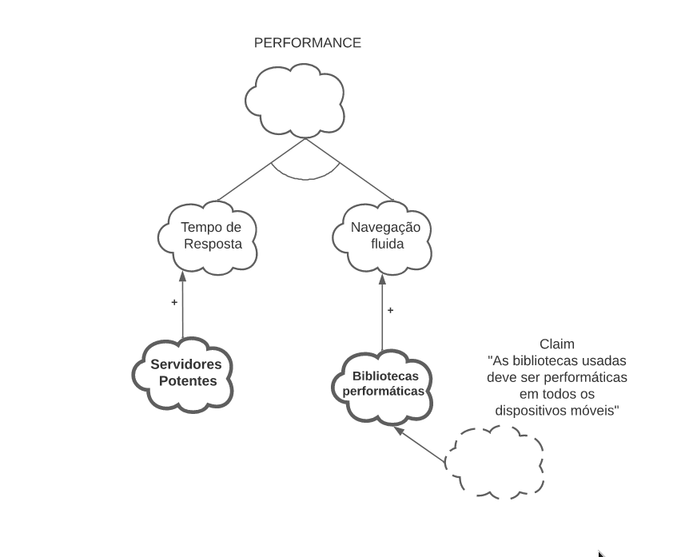
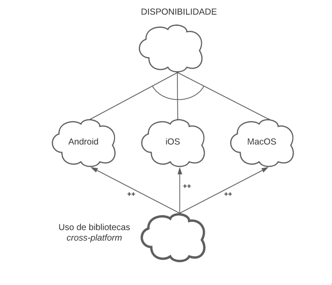

# NFR Framework

## Introdução

O NFR Framework é uma abordagem para representar e analisar Requisitos
Não-Funcionais.
Tem como principal objetivo auxiliar os desenvolvedores no processo
de implantação de soluções personalizadas com a perspectiva das características
do domínio e do sistema em questão.

Essas características incluem os Requisitos Não-Funcionais, Requsitos Funcionais,
prioridades e carga de trabalho. Os Requisitos Não-Funcionais são considerados
cidadãos de primeira ordem.

O Framework trabalha com o conceito de softgoals, e possui um método de análise
quantitativa para definir os status dos softgoals.

## Softgoals

Um softgoal é um objetivo que não tem definição clara nem critérios de aceitação precisos.
São utilizados para representar Requisitos Não-Funcionais e podem estar inter-relacionados,
indicando a influência de um softgoal em outro.

Para representar essa interdependência, usa-se um Softgoal Interdependency Graph (SIG).
Esses gráficos armazenam um registro completo de todas as decisões de desenvolvimento
e da lógica do projeto de forma gráfica e concisa, incluindo os Requisitos Não-Funcionais e suas
alternativas, decisões e justificativas.

Existem três tipos de softgoals, e cada um deles possui uma notação gráfica associada.

### Softgoals NFR

Representam os Requisitos Não-Funcionais.
Podem estar interrelacionados, organizados em catálogos e apresentados
de forma hierárquica durante o desenvolvimento do projeto.

Sua notação gráfica é uma nuvem com contorno simples, como mostra a _figura 1_.

<figcaption>
Imagem 1: Representação gráfica de um softgoal NFR - Elaboração Própria</figcaption>

### Softgoals de Operacionalização

Representam as soluções de implementação que satisfazem os softgoals NFR
em outros softgoals de operacionalização.
Incluem processos, representações de dados, operações, estruturações
e restrições no sistema alvo para atender às necessidades indicadas pelos softgoals em questão.

Sua notação gráfica é uma nuvem com contorno em negrito, como mostra a _imagem 2_.

<figcaption>
Imagem 2: Representação gráfica de um softgoal NFR - Elaboração Própria</figcaption>

### Softgoals de Afirmação

Representam as características de domínio de forma que elas possam ser
consideradas e refletidas durante o processo de tomada de decisão.
Servem como justificativa para a forma de priorização dos softgoals,
decidindo quais deles são selecionados, refinados e priorizados.
Devem ser escritos em linguagem natural, e anotam algo que pode ser
acrescentado ao modelo em um ponto específico.

Sua notação gráfica é uma nuvem com contorno tracejado, como mostra a _imagem 3_.

<figcaption>
Imagem 3: Representação gráfica de um softgoal NFR - Elaboração Própria</figcaption>

## Decomposição

Existem quatro tipos de decompoições no Framework NFR.
Três delas estão associadas a um tipo de softgoal, e a quarta
pode ser aplicada em qualquer tipo.

### Decomposição de um softgoal NFR

Refina ou subdivide um softgoal NFR em outros específicos.
Divide grandes problemas em problemas menores, e ajuda a lidar com ambiguidades
e problemas na priorização.

### Decomposição de Operacionalização

Subdivide um softgoal de operacionalização em outros softgoals de
operacionalização mais específicos.
É útil para definir uma solução geral e refiná-la em soluções mais específicas.

### Decomposição de Afirmação (Claims)

Refina um softgoal de afirmação em outros softgoals de afirmação.
Importante para apoiar ou negar justificativas específicas do projeto.

### Priorização

É um tipo especial de decomposição, que pode ser aplicada em qualquer tipo de softgoal.
Refina um softgoal em outro com o mesmo tipo e tópicos, mas com uma prioridade associada.

## Interdependências

As interdependências são responsáveis por definir as relações entre os softgoals e os tipos de interdependências usadas pelo NFR framework são os refinamentos e contribuições.

### Refinamentos

Definem um tipo de interdependência que ocorre de cima para baixo. Os tipos de refinamento são:

- **Decomposição de Softgoal NFR:** Responsável pelo refinamento ou subdivisão de um softgoal NFR em outros específicos.

- **Decomposição de Operacionalização:** Responsável por subdividir um softgoal de operacionalização em outros softgoals de operacionalização mais específicos.

- **Decomposição de Afirmação (Claims):** Faz o refinamento de um softgoal de afirmação em outros softgoals de afirmação.

- **Priorização:** Onde ocorre o refinamento de um softgoal em outro softgoal com o mesmo tipo de tópicos, mas com uma prioridade associada.

### Contribuições

Conforme os softgoals são refinados sucessivamente, um softgoal descendente
pode contribuir de forma total ou parcial, de forma negativa ou positiva,
para a satisfação do ascendente.

Contribuições descrevem como a satisfação ou não de um softgoal descendente
contribui para a satisfação de um softgoal ascendente, podem ser positivas ou negativas,
ou até satisfazendo completamente o ascendente.

Tipos de contribuição utilizadas pelo framework:

- **AND:** Determina que se os softgoals descendentes forem satisfeitos os softgoals ascendentes serão satisfeitos.
- **OR:** Determina que, se algum softgoal descendente for satisfeito, o ascendente será satisfeito.
- **MAKE(++):** Fornece uma contribuição suficientemente positiva (MAKE) entre um softgoal descendente e um softgoal ascendente que é concebida no nível mais alto de satisfação.
- **BREAK(--):** Fornece uma contribuição suficientemente negativa (BREAK) entre um softgoal descendente e um softgoal ascendente que é concebida no nível mais alto de negação.
- **HELP(+):** Fornece uma contribuição parcialmente positiva entre um softgoal descendente e um softgoal ascendente.
- **HURT(-):** Fornece uma contribuição parcialmente negativa entre um softgoal descendente e um softgoal ascendente.
- **UNKNOWN(?):** Fornece uma contribuição desconhecida entre um softgoal descendente e um softgoal ascendente, podendo ser tanto positiva quanto negativa.
- **EQUALS:** Determina que o softgoal descendente só será satisfeito se o softgoal ascendente for satisfeito e que softgoal descendente será negado se o softgoal ascendente for negado.
- **SOME:** É utilizada quando o sinal da contribuição é conhecido (positivo ou negativo), mas a extensão (parcial ou total) não é. Nesses casos, quando há alguma incerteza em se utilizar HELP ou MAKE deve-se utilizar o tipo de contribuição SOME +. Da mesma forma quando não há certeza em se utilizar HURT ou BREAK deve-se utilizar SOME - .

### Procedimento de Avaliação
O procedimento de Avaliação é responsável por dizer o grau que os requisitos não funcionais são satisfeitos por um conjunto de decisões. Assim, é determinado se cada softgoal ou interdependência do SIG foi satisfeito. Para isso, são utilizados rótulos para os softgoals, que são nomeados como satisfeito, fracamente satisfeito, negado, fracamente negado, conflitante e indeterminado.

<figcaption>
Imagem 4:  Tipos de rótulos utilizados pelos softgoals, retirado da dissertação "NFR4ES: Um Catálogo de Requisitos Não-Funcionais para Sistemas Embarcados", de Reinaldo Antônio da Silva.</figcaption>

## Metodologia

Para o projeto da disciplina, foram realizados diagramas utilizando o [Lucidchart](../planejamentoDoProjeto/ferramentas?id=lucidchart) que compõe alguns princípios da usabilidade, nesse caso **Performance, Segurança e Disponibilidade**, do aplicativo do exército brasileiro. A seguir, nas _imagens 5 a 8_, encontram-se os resultados desses diagramas, separados em quatro tópicos:

### Geral

<figcaption>
Imagem 5:  Diagrama geral NFR - Exército Brasileiro (Autoria - Guilherme Puida)</figcaption>

### Performance

<figcaption>
Imagem 6:  Diagrama de performance NFR - Exército Brasileiro (Autoria - Guilherme Puida)</figcaption>

### Segurança

<figcaption>
Imagem 7:  Diagrama de segurança NFR - Exército Brasileiro (Autoria - Guilherme Puida)</figcaption>

### Disponibilidade

<figcaption>
Imagem 8:  Diagrama de disponibilidade NFR - Exército Brasileiro (Autoria - Guilherme Puida)</figcaption>

## Referências

> Reinaldo Antônio da Silva. "NFR4ES: Um Catálogo de Requisitos Não-Funcionais para Sistemas Embarcados". Universidade Federal de Pernambuco, 2019.

## Histórico de Versão

| Versão | Data | Descrição | Autor | Revisor |
|--------|------|-------|-----------| ------- |
| 0.1 | 03/08/22 | Documento Inicial | Guilherme Puida e Vitor Eduardo | Gabriel Moretti

